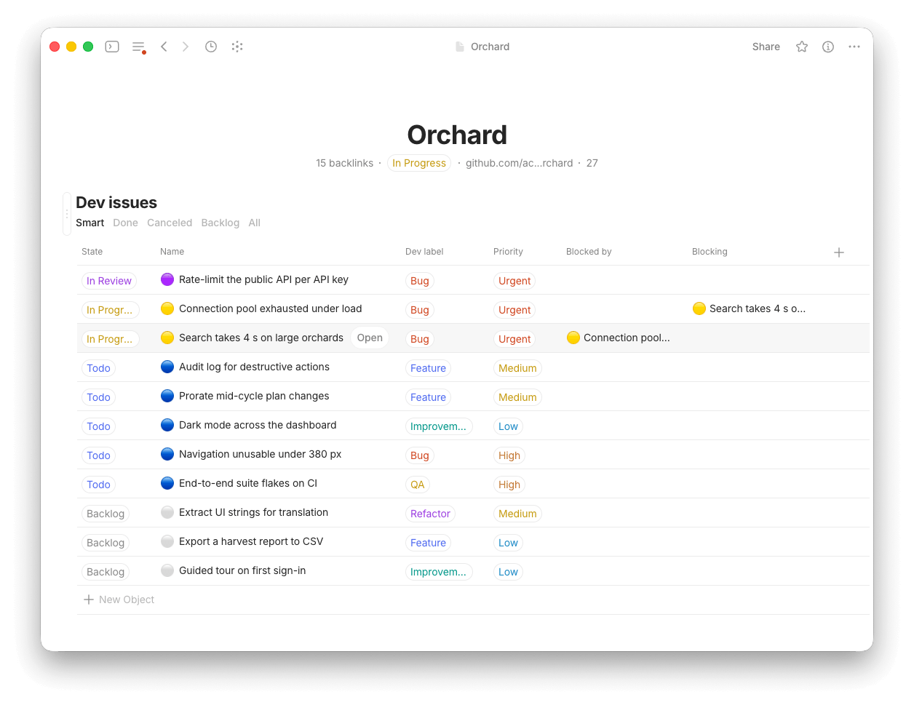

# atl — Anytype as Linear


-informational)
[](https://github.com/Oward-Studio/atl/actions/workflows/ci.yml)


A command-line issue tracker for developers, backed by [Anytype](https://anytype.io) instead of a
hosted service.

## Why

Linear sets a high bar for issue tracking, and deserves it. But for solo development — side
projects — or a small team working alongside AI agents, Anytype turns out to be a solid substitute:
the same tracking model, at no cost, and **local-first**, so the data stays under your own
governance rather than someone else's.

`atl` provides the missing piece: a terminal interface close enough to Linear's that the habits
carry over, deliberately lighter in features, and cheap enough for an AI agent to drive. Reading a
single object through the Anytype MCP server costs **1,964 tokens** — the response embeds the full
type schema. `atl issue done <ref>` returns about ten.

## What it looks like

The same project, from the terminal and from Anytype. `atl` wrote everything on both
sides — the states, the icons, the labels, the dependency, and the 27 % progress.

```
$ atl ls
project: Orchard (ATL_PROJECT)
REF                           STATE        PRIO     TITLE                                  PROJECT
orchard-rate-limit         ◕  In Review    ▲        Rate-limit the public API per API key  Orchard
orchard-search-slow        ◑  In Progress  ▲     ⊘  Search takes 4 s on large orchards     Orchard
orchard-db-pool            ◑  In Progress  ▲        Connection pool exhausted under load   Orchard
orchard-mobile-nav         ◔  Todo         ▰▰▰      Navigation unusable under 380 px       Orchard
orchard-flaky-e2e          ◔  Todo         ▰▰▰      End-to-end suite flakes on CI          Orchard
orchard-audit-log          ◔  Todo         ▰▰▱      Audit log for destructive actions      Orchard
orchard-billing-proration  ◔  Todo         ▰▰▱      Prorate mid-cycle plan changes         Orchard
orchard-dark-mode          ◔  Todo         ▰▱▱      Dark mode across the dashboard         Orchard
orchard-i18n               ○  Backlog      ▰▰▱      Extract UI strings for translation     Orchard
orchard-csv-export         ○  Backlog      ▰▱▱      Export a harvest report to CSV         Orchard
orchard-onboard-tour       ○  Backlog      ▰▱▱      Guided tour on first sign-in           Orchard
⊘ blocked by an unfinished issue
11 issues
```



Three things worth noticing in the app: the issue icon follows the state colour, the
dependency shows on **both** sides — `Blocked by` on one row, `Blocking` on the other —
and the progress in the header was computed and written by the CLI. Anytype remains a
first-class way to read and edit all of it.

## Requirements

Node ≥ 20.11 and the **Anytype desktop application** running: the CLI talks to its local API on
`127.0.0.1:31009`. Nothing leaves the machine.

## Install

```sh
git clone https://github.com/Oward-Studio/atl.git
cd atl
./install.sh      # npm install + npm link + symlink of the Claude Code skill
atl auth          # pairing: Anytype shows a 4-digit code
```

`atl auth` is a single step: it requests pairing, Anytype displays a 4-digit code, you type it in.
**The code is imposed by Anytype's pairing protocol** — the human gesture that authorises the
application, much like Bluetooth pairing. It cannot be bypassed.

A two-step variant exists **only for non-interactive callers** — an agent, a CI script, anything
that cannot answer a prompt:

```sh
atl auth --request                                  # Anytype shows the code; the command returns a challenge id
atl auth --challenge <id> --code <the-4-digits>
```

`<id>` identifies the *challenge*, tying those four digits to that specific pairing request. It is
neither a space nor an account identifier.

The app key is stored in `~/.config/atl/config.json` with mode `0600`, never in the repository.
`atl auth --status` prints the configuration without writing anything.

## Bootstrapping a fresh space

A space that does not yet hold the `dev_issue` and `dev_project` types needs one command:

```sh
atl init --dry-run   # report what would be created
atl init             # create both types, their properties and their tags
```

It is idempotent, and **not a migration**: an existing type is left untouched. Two steps remain
manual because the API cannot perform them — creating each type's default template (it can neither
read nor write a block), and removing the `tag` property that Anytype attaches to every new type.
The command says so rather than leaving them silent.

Without bootstrapping, `issue new`, `project new` and `ls` exit with code 4 and name `atl init`.

## Usage

```sh
atl ls                                   # active issues
atl ls --project X --state started
atl issue view <ref>
atl issue new "title" -p high -l Bug --ac "one criterion"
atl issue start <ref>                    # In progress + branch name + link
atl issue ac check <ref> 1 2             # tick acceptance criteria
atl issue block <ref> --by <ref2>        # dependencies, written on both sides
atl issue delete <ref> [<ref>…]          # irreversible, asks before it acts
atl gain                                 # tokens absorbed by atl instead of your context
atl ls --json --fields ref,state,title   # JSON output trimmed to the useful fields
```

`atl --help` lists every command. All of them accept `--json`; `--fields` trims it further, which
matters when an agent is reading — measured on 221 issues, `--json` costs 20,838 tokens against
3,503 for `--fields ref,state`.

Project progress is recomputed on every event that changes it — the six state transitions and issue
creation — and the variation is printed, never written silently. `atl project stats` remains for
drift introduced by edits made inside the application.

### Multiple spaces

```sh
atl space                  # list spaces, mark the default one
atl space "<name>"         # change the default space
ATL_SPACE="<name>" atl ls  # target another space for a single command
atl init --space "<name>"  # bootstrap another space without moving the default
```

The space comes from the **configuration**, never from whichever space happens to be open in the
application: the API exposes no notion of a current space. `atl space` only rewrites the
configuration — unlike `atl auth --space`, which would ask for pairing again.

### The CLI never runs Git

`atl` drives Anytype. It does not inspect the repository, does not check whether one exists, runs no
`checkout`, opens no pull request. Git context is an input the caller provides:

```sh
atl issue done "$(git branch --show-current)"
```

`atl issue start` records the branch name derived from the issue reference and a link to the
project's repository, the way Linear suggests a name without creating the branch.

## Claude Code skill

`install.sh` symlinks `skill/` to `~/.claude/skills/atl`, so `git pull` is enough to update it. The
skill teaches Claude to reach for `atl` rather than raw Anytype MCP calls, and carries the measured
cost of each command so it can choose the cheap path.

## Usage statistics

`atl gain` compares what the API returned with what actually reached the context. Every invocation
that called the API appends one line to `~/.local/state/atl/usage.jsonl`: command, characters
absorbed, characters rendered, call count, duration. **Never an argument, never issue content**, and
no network call — the file does not leave the machine.

`ATL_NO_USAGE=1` disables recording. Deleting the file resets the counters.

## Development

```sh
npm test          # hermetic tests: no network, no Anytype, no key
npm run test:live # contract tests against the real API, on a disposable project
npm run typecheck
```

### What each suite proves

`npm test` runs against a **fake Anytype server**, so it proves the CLI behaves correctly given a
spec-conformant API: filtering, sorting, reference resolution, criteria parsing, exit codes, escaping.
It cannot prove the spec is still true — a green run says nothing about Anytype having changed.

`npm run test:live` is what checks that: **contract tests** confronting the fake with the real API —
resolvable property keys, states and tags matching, the markdown round trip, the absent reciprocal
relation, and what `atl init` relies on. It needs Anytype running and a paired app key, creates a
disposable LOREM project and a throwaway schema, and deletes both afterwards.

CI therefore runs `npm test` and `npm run typecheck` on Node 20.11 and 22 for every push and pull
request, and leaves `test:live` out. **Run it by hand after an Anytype update**, before trusting a
release: it is the only thing that catches the day an assumption stops holding.

No build step: `tsx` runs `src/` directly. It costs about 80 ms of the ~160 ms startup floor —
a deliberate trade, documented with the measurements in `docs/ANYTYPE-LIMITS.md` §2.7.

Issues and pull requests are welcome, with the scope rules and the frozen decisions stated in
[`CONTRIBUTING.md`](CONTRIBUTING.md) — worth a read before writing a patch, since a change can be
declined on scope alone. This is a personal tool and no support is promised.

The issues of the ⚡ AnyTypeLinear project, inside Anytype, hold the decision history.
[`docs/ANYTYPE-LIMITS.md`](docs/ANYTYPE-LIMITS.md) keeps what would be expensive to rediscover:
the API limits measured one by one, and the features deliberately given up, with the reasoning.
